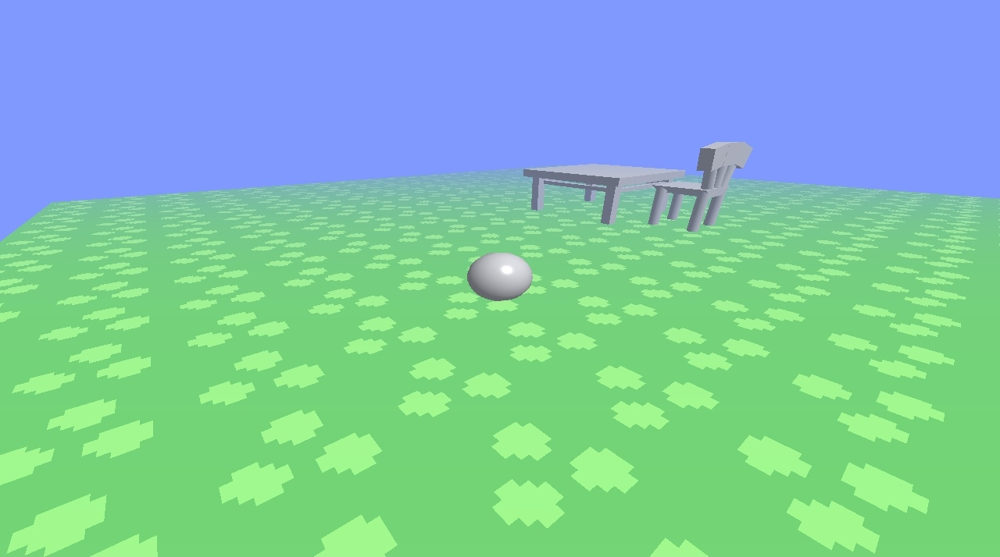

# Aluminium-3D
The 3D version of [Aluminium](https://github.com/EmanuelG-Gaming/Aluminium).

An earlier screenshot from V0.1.

The first level of V0.15.

# Controls
Since I've initially made this game on a tablet, where a touchscreen is used, the controls might be harder to use via the PC's cursor, but here they are:
- Upper half of the screen to look around;
- Lower half of the screen is for player movement:
  - Left/right halves are for moving forward/backwards;
  - For jumping, there's an even lower region, where the mouse button is used.